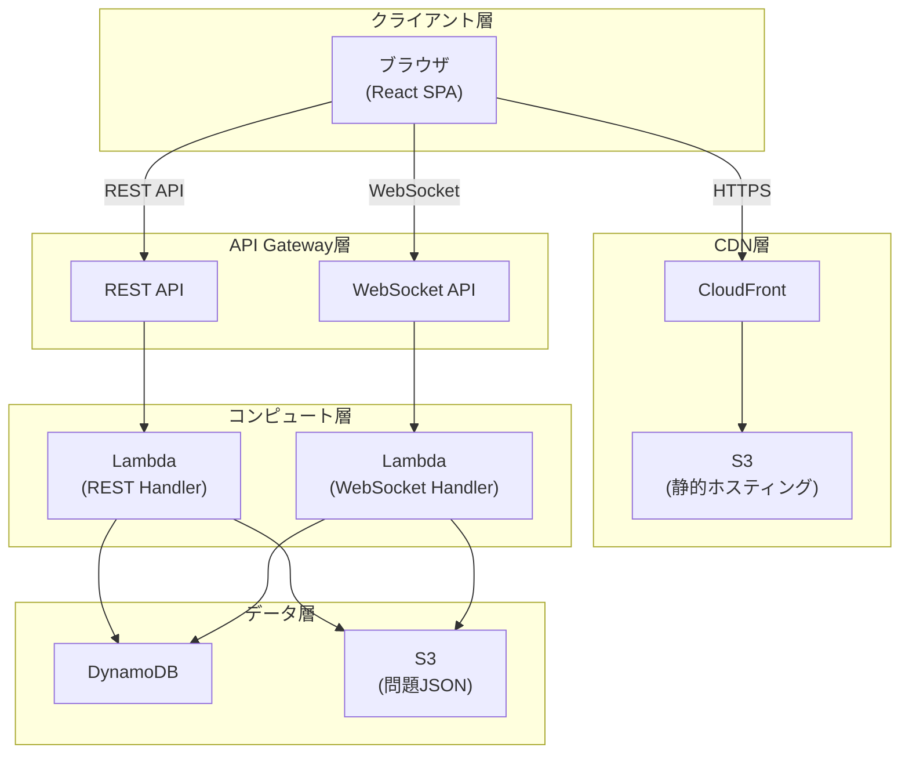
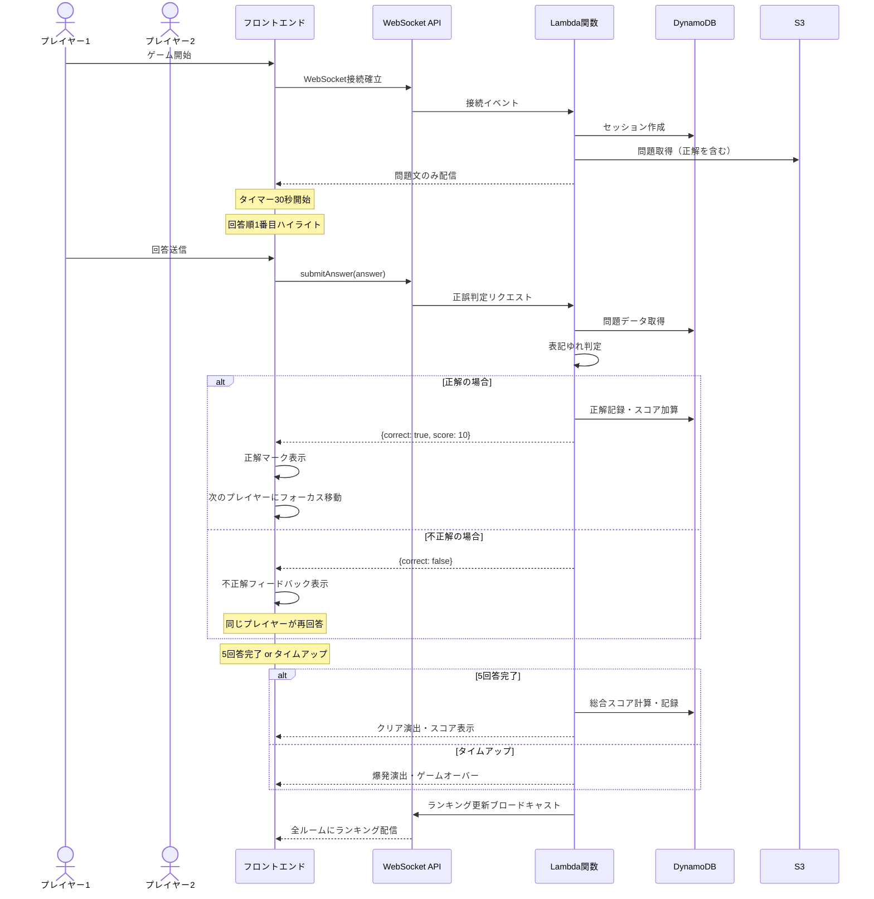
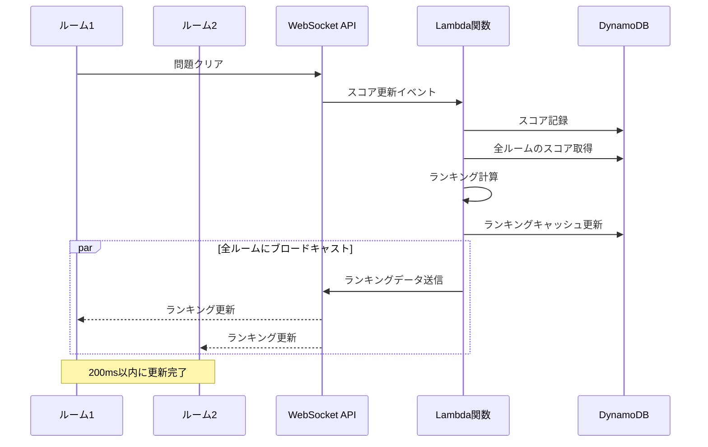

# Technical Design Document

## Overview

ファイブボンバーWebアプリは、ネプリーグの人気クイズゲーム「ファイブボンバー」をWeb上で再現するリアルタイム対戦クイズアプリケーションです。本システムは、5人のプレイヤーが制限時間30秒以内に順番に回答し、複数チームが同時にプレイしながらリアルタイムでランキングを競い合うゲーム体験を提供します。

AWSサーバーレスアーキテクチャを全面採用し、React 19 + TypeScriptによるモダンなフロントエンド、Node.js 22.x + TypeScriptによるLambda関数群、DynamoDBとS3による永続化層を組み合わせた、スケーラブルで保守性の高いシステムを構築します。WebSocketによるリアルタイム双方向通信により、50-100ms以内の低遅延な正誤判定とランキング更新を実現し、ユーザーに緊張感のあるゲーム体験を提供します。

インフラストラクチャはTerraformでコード管理し、**別リポジトリ（hima-five-bomber-infrastructure）**で管理します。これにより、アプリケーションコードとインフラコードのライフサイクルを分離し、デプロイ戦略を柔軟に管理できます。GitHub Actionsによる自動化されたCI/CDパイプラインを通じて、再現性と保守性を確保します。初期構成では本番環境（prd）のみを展開し、将来的に開発環境（dev）・ステージング環境（stg）を追加可能な拡張性の高い設計を採用します。

**インフラ構成の参照**:
- AWSリソースの構成、リソース名、命名規則については、**../hima-five-bomber-infrastructure/.kiro/**を参照してください
- インフラリポジトリの仕様書に記載されたリソース名・構成に従って、アプリケーションコードを実装します
- デプロイ時は、インフラリポジトリで定義されたリソースが既に存在することを前提とします

### Goals

- PC・スマートフォンの両方から快適にプレイ可能なレスポンシブUIを実現
- WebSocketを活用した50-100ms以内の低遅延リアルタイム通信を実現
- 複数チームの同時プレイとリアルタイムランキング更新を実現
- 表記ゆれに対応した公平な正誤判定システムを実現
- サーバーレスアーキテクチャによるスケーラブルで低コストな運用を実現
- TerraformとGitHub ActionsによるIaCとCI/CD自動化を実現

### Non-Goals

- ユーザー認証・アカウント管理（将来的にAWS Cognito統合を検討）
- リプレイ・観戦モード（将来的な拡張機能）
- 音声チャット機能（将来的な拡張機能）
- モバイルネイティブアプリ（PWA対応は検討可能）
- ゲーム結果の長期保存・統計分析（初期フェーズではセッション終了時にデータ削除）

## Architecture

### High-Level Architecture



> 📝 編集: [architecture.drawio.svg](./images/architecture.drawio.svg) をVS CodeまたはDraw.ioで開く

<details>
<summary>Mermaid版（テキスト表現）</summary>



</details>

### Architecture Integration

**既存パターンの尊重**:
- 本プロジェクトは新規開発（greenfield）のため、既存システムとの統合は不要
- ただし、将来的な拡張性を考慮し、モジュール化された設計を採用

**新規コンポーネントの合理性**:
- **React SPA**: モダンなUI/UXとレスポンシブデザインを実現するため
- **API Gateway**: REST APIとWebSocket APIの統一的な管理とスロットリングのため
- **Lambda Functions**: サーバーレスアーキテクチャによるスケーラビリティと低コスト運用のため
- **DynamoDB**: 高速なデータアクセスとスケーラビリティを実現するため
- **S3**: 静的ホスティングと問題JSONの永続化のため
- **CloudFront**: グローバルな低レイテンシ配信を実現するため

**技術スタックの整合性**:
- TypeScriptをフロントエンド・バックエンドで統一し、型安全性を確保
- AWSマネージドサービスのみを使用し、運用負荷を最小化
- Terraformによる全リソースのIaC化により、再現性を確保

**Steeringコンプライアンス**:
- `structure.md`: モジュール化されたディレクトリ構造に準拠。インフラコードは別リポジトリ（hima-five-bomber-infrastructure）で管理
- `tech.md`: 指定された技術スタック（React 19, TypeScript, Tailwind CSS, Lambda, DynamoDB, Terraform）を使用
- `product.md`: リアルタイム対戦、マルチチーム対応、表記ゆれ対応の要件を満たす設計

### Technology Stack and Design Decisions

#### Frontend
- **React 19**: UIフレームワーク - React Compilerによる自動最適化、Actionsによる簡潔なフォーム処理
- **TypeScript**: 型安全な開発 - コンパイル時の型チェックによるバグ削減
- **Tailwind CSS**: ユーティリティファーストCSS - レスポンシブデザインの迅速な実装
- **Socket.io-client**: WebSocket通信 - リアルタイム双方向通信の簡潔な実装
- **Vite**: ビルドツール - 高速な開発サーバーと最適化されたプロダクションビルド

#### Backend
- **AWS Lambda (Node.js 22.x + TypeScript)**: サーバーレスコンピュート - スケーラビリティと低コスト
- **API Gateway (REST + WebSocket)**: APIエンドポイント管理 - 統一的なAPI管理とスロットリング
- **DynamoDB**: NoSQLデータベース - 低レイテンシと自動スケーリング
- **S3**: オブジェクトストレージ - 静的ホスティングと問題JSON格納
- **CloudFront**: CDN - グローバルな低レイテンシ配信

#### Infrastructure as Code (別リポジトリ管理)
- **Terraform**: インフラ定義 - 宣言的な構成管理と再現性
- **Repository**: `hima-five-bomber-infrastructure` - アプリケーションコードとライフサイクルを分離

#### CI/CD
- **GitHub Actions**: 自動化パイプライン - Lint, Test, Build, Deployの自動化

#### Key Design Decisions

##### Decision 1: WebSocketによるハイブリッドアプローチ採用

**Context**: ゲームの正誤判定をフロントエンドで行うかバックエンドで行うかの判断が必要。フロントエンド判定は高速だが正解データが露出し、バックエンド判定は安全だがネットワーク遅延が発生する。

**Alternatives**:
1. **フロントエンド判定**: 問題データと正解をフロントエンドに送信し、ブラウザ内で判定
2. **REST API判定**: 回答ごとにREST APIを呼び出して判定
3. **WebSocket判定**: WebSocket接続を確立し、双方向通信で判定

**Selected Approach**: WebSocket判定（ハイブリッドアプローチ）

**Rationale**:
- 正解データをバックエンドで秘匿し、チート対策を実現
- WebSocketの低遅延特性により、50-100ms以内のレスポンスを実現
- リアルタイムなゲーム状態同期とランキング更新を同一接続で実現
- REST APIと比較してオーバーヘッドが少ない

**Trade-offs**:
- **Gain**: セキュリティ、公平性、リアルタイム性、ユーザー体験の向上
- **Sacrifice**: フロントエンド判定と比較してわずかなレイテンシ（50-100ms）、WebSocket接続管理の複雑さ

##### Decision 2: DynamoDBによるセッション管理

**Context**: ルーム・ゲームセッション・スコアなどの一時的なデータをどのように管理するかの判断が必要。RDBMSは整合性が高いが、サーバーレス環境では接続管理が複雑になる。

**Alternatives**:
1. **RDS (PostgreSQL/MySQL)**: リレーショナルデータベース - 強い整合性とSQL
2. **ElastiCache (Redis)**: インメモリキャッシュ - 超低レイテンシ
3. **DynamoDB**: NoSQLデータベース - マネージドサービスで自動スケーリング

**Selected Approach**: DynamoDB

**Rationale**:
- Lambdaとの親和性が高く、接続管理が不要（HTTPベースアクセス）
- 自動スケーリングにより、同時アクセス数の変動に対応
- サーバーレスアーキテクチャの一貫性を保持
- DynamoDB Streamsにより、将来的なイベント駆動アーキテクチャへの拡張が容易

**Trade-offs**:
- **Gain**: 運用負荷の削減、自動スケーリング、Lambdaとの統合容易性
- **Sacrifice**: RDBMSと比較してクエリの柔軟性が低い、複雑なトランザクション処理が困難

##### Decision 3: Terraformによる全リソース管理

**Context**: AWSリソースをどのように管理するかの判断が必要。AWS CDKはTypeScriptで記述できるが、Terraformはマルチクラウド対応とHCLによる宣言的記述が特徴。

**Alternatives**:
1. **AWS CDK**: TypeScriptでインフラ定義 - アプリケーションコードと同じ言語
2. **CloudFormation**: AWSネイティブIaC - AWS統合が最も強力
3. **Terraform**: HCLでインフラ定義 - マルチクラウド対応と宣言的記述

**Selected Approach**: Terraform

**Rationale**:
- HCLによる宣言的で読みやすいインフラ定義
- 強力なstate管理とdiff表示により、変更の影響範囲を明確化
- モジュール化により、環境（dev/stg/prd）間での再利用が容易
- マルチクラウド対応により、将来的な選択肢を保持

**Trade-offs**:
- **Gain**: 宣言的記述、強力なstate管理、モジュール再利用性、マルチクラウド対応
- **Sacrifice**: AWS CDKと比較してTypeScriptの型安全性が得られない、CloudFormationと比較してAWS固有機能の対応が遅れる場合がある

## System Flows

### ゲームプレイフロー



### リアルタイムランキング更新フロー



## Requirements Traceability

| 要件 | 要件概要 | コンポーネント | インターフェース | フロー |
|------|----------|----------------|------------------|--------|
| 1.1-1.7 | ルーム管理機能 | RoomService, RoomRepository | POST /api/rooms, GET /api/rooms/:id | - |
| 2.1-2.16 | ゲームプレイ機能 | GameService, AnswerValidator, Timer | WebSocket: submitAnswer, GameBoard UI | ゲームプレイフロー |
| 3.1-3.5 | スコアリング機能 | ScoreCalculator, ScoreRepository | calculateScore(), recordScore() | ゲームプレイフロー |
| 4.1-4.4 | リアルタイムランキング | RankingService, WebSocketBroadcaster | WebSocket: broadcastRanking | ランキング更新フロー |
| 5.1-5.7 | 問題管理機能 | QuestionService, S3Repository | POST/GET/PUT/DELETE /api/questions | - |
| 6.1-6.6 | 正誤判定・表記ゆれ | AnswerValidator, TextNormalizer | validateAnswer(), normalize() | ゲームプレイフロー |
| 7.1-7.5 | レスポンシブデザイン | React Components (Tailwind CSS) | - | - |
| 8.1-8.5 | インフラストラクチャ | Terraform Modules | - | - |
| 9.1-9.6 | CI/CDパイプライン | GitHub Actions Workflows | - | - |
| 10.1-10.7 | セキュリティ対策 | 全コンポーネント（横断的関心事） | - | - |
| 11.1-11.5 | パフォーマンス要件 | 全コンポーネント（非機能要件） | - | - |

## Components and Interfaces

### フロントエンド層

#### GameBoardコンポーネント

**Responsibility & Boundaries**
- **Primary Responsibility**: ゲームプレイ画面全体の表示とユーザー操作の管理
- **Domain Boundary**: UI/UXレイヤー（プレゼンテーション層）
- **Data Ownership**: ローカルUIステート（回答入力、アニメーション状態等）
- **Transaction Boundary**: なし（状態管理はuseGameState hookに委譲）

**Dependencies**
- **Inbound**: App.tsxからルーティング経由で呼び出される
- **Outbound**: Timer, AnswerInput, Scoreboard, BombExplosionコンポーネント、useGameState, useWebSocket hooks
- **External**: なし

**Contract Definition**

**Service Interface**:
```typescript
interface GameBoardProps {
  roomId: string;
  playerId: string;
}

interface GameBoardComponent {
  (props: GameBoardProps): JSX.Element;
}
```

**State Management**:
```typescript
interface GameState {
  question: Question | null;
  currentTurn: number; // 0-4 (5人の回答順)
  answers: Answer[]; // 最大5つの回答
  timeRemaining: number; // 残り時間（秒）
  players: Player[]; // ルーム内のプレイヤーリスト
}

interface Answer {
  playerId: string;
  value: string;
  isCorrect: boolean;
  timestamp: number;
}
```

- **Preconditions**: roomIdとplayerIdが有効であること、WebSocket接続が確立されていること
- **Postconditions**: ゲーム終了時に結果画面に遷移すること
- **Invariants**: currentTurnは常に0-4の範囲内、answersの長さは最大5

#### useWebSocket Hook

**Responsibility & Boundaries**
- **Primary Responsibility**: WebSocket接続の確立・維持とメッセージ送受信の管理
- **Domain Boundary**: 通信レイヤー（フロントエンド）
- **Data Ownership**: WebSocket接続状態、受信メッセージキュー
- **Transaction Boundary**: 単一WebSocket接続のライフサイクル

**Dependencies**
- **Inbound**: GameBoard, RoomLobbyなどの各コンポーネント
- **Outbound**: Socket.io-client、useGameState hook
- **External**: Socket.io-client (npm package)

**External Dependencies Investigation**:
- **Socket.io-client v4.x**: WebSocket通信ライブラリ
  - 自動再接続、フォールバック機能（long polling等）を提供
  - サーバー側はAPI Gateway WebSocket APIとの接続を確立
  - イベントベースのメッセージ送受信をサポート
  - TypeScript型定義が公式に提供される
- **Authentication**: 初期接続時にplayerIdをクエリパラメータで送信
- **Reconnection Strategy**: 指数バックオフによる自動再接続（最大3回）

**Contract Definition**

**Service Interface**:
```typescript
interface UseWebSocketHook {
  (): {
    isConnected: boolean;
    sendAnswer: (answer: string) => void;
    sendMessage: (type: string, payload: unknown) => void;
    error: Error | null;
  };
}

type WebSocketMessage =
  | { type: 'questionStart'; payload: QuestionPayload }
  | { type: 'answerResult'; payload: AnswerResultPayload }
  | { type: 'rankingUpdate'; payload: RankingPayload }
  | { type: 'gameOver'; payload: GameOverPayload };

interface QuestionPayload {
  questionId: string;
  questionText: string;
  category: string;
  difficulty: string;
}

interface AnswerResultPayload {
  correct: boolean;
  score?: number;
  nextTurn: number;
}

interface RankingPayload {
  rankings: RankingEntry[];
}

interface RankingEntry {
  roomId: string;
  teamName: string;
  score: number;
  rank: number;
}

interface GameOverPayload {
  success: boolean;
  totalScore: number;
  timeBonus: number;
}
```

- **Preconditions**: 環境変数にWebSocket URLが設定されていること
- **Postconditions**: コンポーネントアンマウント時に接続をクリーンアップすること
- **Invariants**: 接続状態とisConnectedフラグは常に一致

### バックエンド層（ビジネスロジック）

#### GameService

**Responsibility & Boundaries**
- **Primary Responsibility**: ゲームセッションの状態管理とビジネスロジックの実行
- **Domain Boundary**: ゲームドメイン（コアビジネスロジック）
- **Data Ownership**: ゲームセッションの状態（進行状況、回答履歴）
- **Transaction Boundary**: 単一ゲームセッション内の状態遷移

**Dependencies**
- **Inbound**: WebSocketハンドラー（submitAnswer, syncGameState）
- **Outbound**: SessionRepository, QuestionService, ScoreCalculator, AnswerValidator
- **External**: なし

**Contract Definition**

**Service Interface**:
```typescript
interface GameService {
  startGame(sessionId: string, questionId: string): Promise<Result<GameSession, GameError>>;
  submitAnswer(sessionId: string, playerId: string, answer: string): Promise<Result<AnswerResult, GameError>>;
  getGameState(sessionId: string): Promise<Result<GameState, GameError>>;
  endGame(sessionId: string): Promise<Result<GameResult, GameError>>;
}

interface GameSession {
  sessionId: string;
  roomId: string;
  questionId: string;
  startedAt: number;
  currentTurn: number;
  answers: AnswerRecord[];
  status: 'playing' | 'completed' | 'timeout';
}

interface AnswerRecord {
  playerId: string;
  answer: string;
  isCorrect: boolean;
  timestamp: number;
}

interface AnswerResult {
  correct: boolean;
  score: number;
  nextTurn: number;
  gameCompleted: boolean;
}

interface GameResult {
  success: boolean;
  totalScore: number;
  correctAnswers: number;
  timeBonus: number;
}

type GameError =
  | { type: 'SessionNotFound'; sessionId: string }
  | { type: 'InvalidTurn'; expectedPlayerId: string; actualPlayerId: string }
  | { type: 'GameAlreadyEnded'; sessionId: string }
  | { type: 'TimeoutExceeded'; timeRemaining: number };

type Result<T, E> =
  | { success: true; value: T }
  | { success: false; error: E };
```

- **Preconditions**: sessionIdが有効であること、ゲームが開始済みであること
- **Postconditions**: 回答が記録されること、スコアが計算されること、次の回答者が決定されること
- **Invariants**: currentTurnは常に0-4の範囲内、answersの長さは最大5、タイムアウト時はstatusが'timeout'

#### AnswerValidator

**Responsibility & Boundaries**
- **Primary Responsibility**: 回答の正誤判定と表記ゆれ対応処理
- **Domain Boundary**: 検証ドメイン（ドメインサービス）
- **Data Ownership**: なし（ステートレス）
- **Transaction Boundary**: 単一回答の検証

**Dependencies**
- **Inbound**: GameService
- **Outbound**: TextNormalizer, QuestionService
- **External**: なし

**Contract Definition**

**Service Interface**:
```typescript
interface AnswerValidator {
  validate(answer: string, correctAnswers: string[], acceptableVariations: AcceptableVariations): ValidationResult;
}

interface AcceptableVariations {
  [correctAnswer: string]: string[];
}

interface ValidationResult {
  isCorrect: boolean;
  matchedAnswer?: string;
  normalizedInput: string;
}

interface TextNormalizer {
  normalize(text: string): string;
  toHiragana(text: string): string;
  toKatakana(text: string): string;
  toHalfWidth(text: string): string;
}
```

**検証ロジック**:
1. 入力文字列の正規化（トリミング、全角→半角変換）
2. 正解リストとの完全一致判定（優先）
3. acceptableVariationsとの照合（ひらがな/カタカナ、異体字対応）
4. 照合結果の返却

- **Preconditions**: correctAnswersが空でないこと
- **Postconditions**: ValidationResultを返却すること
- **Invariants**: ステートレスであること（副作用なし）

#### ScoreCalculator

**Responsibility & Boundaries**
- **Primary Responsibility**: スコア計算ロジックの実装
- **Domain Boundary**: スコアリングドメイン（ドメインサービス）
- **Data Ownership**: なし（ステートレス）
- **Transaction Boundary**: 単一スコア計算

**Dependencies**
- **Inbound**: GameService
- **Outbound**: なし
- **External**: なし

**Contract Definition**

**Service Interface**:
```typescript
interface ScoreCalculator {
  calculateAnswerScore(): number; // 正解1つあたり10点
  calculateTimeBonus(timeRemaining: number): number; // 残り時間1秒につき1点
  calculateTotalScore(correctAnswers: number, timeRemaining: number): number;
}

const SCORE_PER_ANSWER = 10;
const SCORE_PER_SECOND = 1;
```

- **Preconditions**: timeRemainingが0以上30以下であること
- **Postconditions**: スコアを返却すること
- **Invariants**: ステートレスであること、スコアルールは定数で定義

### バックエンド層（データアクセス）

#### SessionRepository

**Responsibility & Boundaries**
- **Primary Responsibility**: DynamoDBへのゲームセッションデータの永続化とクエリ
- **Domain Boundary**: データアクセス層
- **Data Ownership**: GameSessionsテーブルのデータ
- **Transaction Boundary**: 単一アイテムの読み書き（DynamoDB制約）

**Dependencies**
- **Inbound**: GameService
- **Outbound**: AWS SDK DynamoDB DocumentClient
- **External**: AWS SDK for JavaScript v3

**External Dependencies Investigation**:
- **AWS SDK for JavaScript v3**: AWS DynamoDBクライアント
  - DocumentClientによる高レベルAPI（マーシャリング/アンマーシャリング自動）
  - PutItem, GetItem, UpdateItem, QueryなどのDynamoDB操作を提供
  - エクスポネンシャルバックオフによる自動リトライ
  - IAM認証による安全なアクセス制御
- **DynamoDB制約**: 単一アイテムは最大400KB、トランザクションは最大25アイテム

**Contract Definition**

**Service Interface**:
```typescript
interface SessionRepository {
  create(session: GameSession): Promise<Result<GameSession, RepositoryError>>;
  get(sessionId: string): Promise<Result<GameSession | null, RepositoryError>>;
  update(sessionId: string, updates: Partial<GameSession>): Promise<Result<GameSession, RepositoryError>>;
  delete(sessionId: string): Promise<Result<void, RepositoryError>>;
}

type RepositoryError =
  | { type: 'ConnectionError'; message: string }
  | { type: 'ValidationError'; message: string }
  | { type: 'NotFoundError'; sessionId: string };
```

- **Preconditions**: DynamoDBテーブルが存在すること、IAMロールが適切に設定されていること
- **Postconditions**: データが永続化されること、エラー時にRepositoryErrorを返却すること
- **Invariants**: sessionIdは一意であること

#### RoomRepository

**Responsibility & Boundaries**
- **Primary Responsibility**: DynamoDBへのルームデータの永続化とクエリ
- **Domain Boundary**: データアクセス層
- **Data Ownership**: Roomsテーブルのデータ
- **Transaction Boundary**: 単一アイテムの読み書き

**Dependencies**
- **Inbound**: RoomService
- **Outbound**: AWS SDK DynamoDB DocumentClient
- **External**: AWS SDK for JavaScript v3

**Contract Definition**

**Service Interface**:
```typescript
interface RoomRepository {
  create(room: Room): Promise<Result<Room, RepositoryError>>;
  get(roomId: string): Promise<Result<Room | null, RepositoryError>>;
  addPlayer(roomId: string, player: Player): Promise<Result<Room, RepositoryError>>;
  removePlayer(roomId: string, playerId: string): Promise<Result<Room, RepositoryError>>;
  updateHost(roomId: string, newHostId: string): Promise<Result<Room, RepositoryError>>;
}

interface Room {
  roomId: string;
  hostId: string;
  players: Player[];
  status: 'waiting' | 'playing' | 'finished';
  createdAt: number;
}

interface Player {
  playerId: string;
  name: string;
  joinedAt: number;
}
```

- **Preconditions**: DynamoDBテーブルが存在すること
- **Postconditions**: ルームデータが永続化されること
- **Invariants**: roomIdは一意であること、playersの長さは最大5

### バックエンド層（API Handler）

#### REST API Handlers

**Responsibility & Boundaries**
- **Primary Responsibility**: REST APIリクエストの受信、バリデーション、レスポンス構築
- **Domain Boundary**: APIレイヤー
- **Data Ownership**: なし（リクエスト/レスポンスの変換のみ）
- **Transaction Boundary**: 単一HTTPリクエスト

**Dependencies**
- **Inbound**: API Gateway REST API
- **Outbound**: RoomService, QuestionService
- **External**: なし

**API Contract**:

| Method | Endpoint | Request | Response | Errors |
|--------|----------|---------|----------|--------|
| POST | /api/rooms | `{ hostName: string }` | `{ roomId: string, hostId: string }` | 400, 500 |
| GET | /api/rooms/:roomId | - | `Room` | 404, 500 |
| POST | /api/rooms/:roomId/join | `{ playerName: string }` | `{ playerId: string }` | 400, 409, 500 |
| DELETE | /api/rooms/:roomId/players/:playerId | - | `{ success: true }` | 404, 500 |
| POST | /api/questions | `Question` | `{ questionId: string }` | 400, 500 |
| GET | /api/questions | `?category=string&difficulty=string` | `Question[]` | 500 |
| GET | /api/questions/:questionId | - | `Question` | 404, 500 |
| PUT | /api/questions/:questionId | `Question` | `Question` | 400, 404, 500 |
| DELETE | /api/questions/:questionId | - | `{ success: true }` | 404, 500 |

**エラーレスポンス形式**:
```typescript
interface ErrorResponse {
  error: {
    code: string;
    message: string;
    details?: unknown;
  };
}
```

#### WebSocket API Handlers

**Responsibility & Boundaries**
- **Primary Responsibility**: WebSocket接続管理とメッセージルーティング
- **Domain Boundary**: APIレイヤー
- **Data Ownership**: 接続ID管理（DynamoDB Connectionsテーブル）
- **Transaction Boundary**: 単一WebSocketメッセージ

**Dependencies**
- **Inbound**: API Gateway WebSocket API
- **Outbound**: GameService, ConnectionManager
- **External**: なし

**Event Contract**:

**Published Events**:
- **questionStart**: ゲーム開始時に問題を配信（問題文のみ、正解は含まない）
- **answerResult**: 正誤判定結果を返却（correct, score, nextTurn）
- **rankingUpdate**: ランキング更新時に全ルームにブロードキャスト
- **gameOver**: ゲーム終了時に結果を配信（success, totalScore, timeBonus）

**Subscribed Events**:
- **connect**: WebSocket接続確立時（connectionIdを記録）
- **disconnect**: WebSocket切断時（connectionIdを削除）
- **submitAnswer**: 回答送信時（GameServiceに委譲）
- **syncGameState**: ゲーム状態同期リクエスト時（現在の状態を返却）

**Idempotency**: submitAnswerは同じ回答を重複送信した場合、最初の送信のみを処理

**Delivery**: At-least-once（WebSocketの特性により保証）

## Data Models

### Domain Model

#### Core Concepts

**Aggregates**:
- **Roomアグリゲート**: ルーム作成からゲーム終了までのライフサイクルを管理
  - ルートエンティティ: Room
  - 子エンティティ: Player（値オブジェクト）
  - トランザクション境界: 単一ルーム内の操作（プレイヤー追加・削除、ホスト変更）

- **GameSessionアグリゲート**: ゲームセッションの状態と回答履歴を管理
  - ルートエンティティ: GameSession
  - 子エンティティ: AnswerRecord（値オブジェクト）
  - トランザクション境界: 単一セッション内の回答・スコア計算

**Entities**:
- **Room**: ルームID、ホストID、プレイヤーリスト、ステータス
- **GameSession**: セッションID、ルームID、問題ID、開始時刻、現在の回答順、回答履歴、ステータス
- **Question**: 問題ID、問題文、正解リスト、許容表記、カテゴリ、難易度

**Value Objects**:
- **Player**: プレイヤーID、名前、参加時刻（不変）
- **AnswerRecord**: プレイヤーID、回答、正誤、タイムスタンプ（不変）
- **Score**: 正解スコア、時間ボーナス、合計スコア（不変）

**Domain Events**:
- **RoomCreated**: ルーム作成時
- **PlayerJoined**: プレイヤー参加時
- **PlayerLeft**: プレイヤー退出時
- **GameStarted**: ゲーム開始時
- **AnswerSubmitted**: 回答送信時
- **GameCompleted**: ゲーム完了時
- **RankingUpdated**: ランキング更新時

**Business Rules & Invariants**:
- ルーム内のプレイヤー数は最大5人
- ゲーム中のルームは新規プレイヤーの参加を拒否
- 回答順は0-4の範囲内
- 制限時間は30秒
- 正解は5つ必要
- スコアは正解1つにつき10点、残り時間1秒につき1点

### Physical Data Model

#### DynamoDB Tables

**Roomsテーブル**:
```typescript
interface RoomsTableItem {
  // Primary Key
  PK: string; // "ROOM#<roomId>"
  SK: string; // "METADATA"

  // Attributes
  roomId: string;
  hostId: string;
  players: {
    playerId: string;
    name: string;
    joinedAt: number;
  }[];
  status: 'waiting' | 'playing' | 'finished';
  createdAt: number;
  updatedAt: number;

  // TTL
  ttl: number; // ゲーム終了後24時間で自動削除
}
```

**Indexes**:
- Primary Key: `PK` (Partition Key), `SK` (Sort Key)
- GSI1: `status` (Partition Key), `createdAt` (Sort Key) - ステータス別のルーム一覧取得用

**GameSessionsテーブル**:
```typescript
interface GameSessionsTableItem {
  // Primary Key
  PK: string; // "SESSION#<sessionId>"
  SK: string; // "METADATA"

  // Attributes
  sessionId: string;
  roomId: string;
  questionId: string;
  startedAt: number;
  currentTurn: number;
  answers: {
    playerId: string;
    answer: string;
    isCorrect: boolean;
    timestamp: number;
  }[];
  status: 'playing' | 'completed' | 'timeout';
  totalScore: number;

  // TTL
  ttl: number; // ゲーム終了後24時間で自動削除
}
```

**Indexes**:
- Primary Key: `PK` (Partition Key), `SK` (Sort Key)
- GSI1: `roomId` (Partition Key), `startedAt` (Sort Key) - ルーム別のセッション履歴取得用

**Scoresテーブル**:
```typescript
interface ScoresTableItem {
  // Primary Key
  PK: string; // "SCORE#<sessionId>"
  SK: string; // "PLAYER#<playerId>"

  // Attributes
  sessionId: string;
  playerId: string;
  roomId: string;
  score: number;
  correctAnswers: number;
  timeBonus: number;
  timestamp: number;

  // TTL
  ttl: number; // ゲーム終了後24時間で自動削除
}
```

**Indexes**:
- Primary Key: `PK` (Partition Key), `SK` (Sort Key)
- GSI1: `roomId` (Partition Key), `score` (Sort Key, descending) - ランキング取得用

**Connectionsテーブル**:
```typescript
interface ConnectionsTableItem {
  // Primary Key
  PK: string; // "CONNECTION#<connectionId>"
  SK: string; // "METADATA"

  // Attributes
  connectionId: string;
  playerId: string;
  roomId: string;
  connectedAt: number;

  // TTL
  ttl: number; // 接続切断後1時間で自動削除
}
```

**Indexes**:
- Primary Key: `PK` (Partition Key), `SK` (Sort Key)
- GSI1: `roomId` (Partition Key), `connectedAt` (Sort Key) - ルーム内の接続一覧取得用

**Partitioning Strategy**:
- ルームID、セッションIDをパーティションキーとして使用し、ホットパーティションを回避
- TTLによる自動削除により、データ量を一定に保つ

#### S3 Bucket Structure

**five-bomber-questions バケット**:
```
s3://five-bomber-questions/
  ├── questions/
  │   ├── geography/
  │   │   ├── easy/
  │   │   │   └── question-001.json
  │   │   ├── medium/
  │   │   └── hard/
  │   ├── history/
  │   ├── science/
  │   └── entertainment/
  └── metadata/
      └── index.json  # 全問題のメタデータ
```

**Question JSONスキーマ**:
```typescript
interface QuestionFile {
  id: string;
  question: string;
  answers: string[]; // 5つ以上の正解
  acceptableVariations: {
    [answer: string]: string[];
  };
  category: string;
  difficulty: 'easy' | 'medium' | 'hard';
  createdAt: number;
  updatedAt: number;
}
```

### Data Contracts & Integration

**API Data Transfer**:
- リクエスト/レスポンスはJSON形式
- 日付はISO 8601形式（タイムスタンプはUnix時間）
- 文字エンコーディングはUTF-8

**Event Schemas**:
```typescript
// WebSocketメッセージスキーマ
type WebSocketEvent =
  | { type: 'questionStart'; payload: QuestionStartPayload }
  | { type: 'answerResult'; payload: AnswerResultPayload }
  | { type: 'rankingUpdate'; payload: RankingUpdatePayload }
  | { type: 'gameOver'; payload: GameOverPayload };

interface QuestionStartPayload {
  questionId: string;
  questionText: string;
  category: string;
  difficulty: string;
  timeLimit: number; // 常に30
}

interface AnswerResultPayload {
  correct: boolean;
  score?: number;
  nextTurn: number;
  gameCompleted: boolean;
}

interface RankingUpdatePayload {
  rankings: {
    roomId: string;
    teamName: string;
    score: number;
    rank: number;
  }[];
}

interface GameOverPayload {
  success: boolean;
  totalScore: number;
  correctAnswers: number;
  timeBonus: number;
}
```

**Schema Versioning Strategy**:
- WebSocketメッセージにversionフィールドを追加（将来的な拡張用）
- 後方互換性を維持するため、フィールド追加のみを許可（削除・変更は非推奨）

**Cross-Service Data Management**:
- DynamoDB Streamsを使用した非同期イベント処理（将来的な拡張）
- 整合性はEventual Consistencyで十分（ゲームの性質上、厳密な整合性は不要）

## Error Handling

### Error Strategy

本システムでは、エラーを3つのカテゴリに分類し、それぞれに適したハンドリング戦略を採用します。

1. **ユーザーエラー（4xx）**: クライアントの誤操作や不正なリクエストに起因するエラー
2. **システムエラー（5xx）**: インフラストラクチャやバックエンドの障害に起因するエラー
3. **ビジネスロジックエラー（422）**: ビジネスルール違反に起因するエラー

### Error Categories and Responses

#### User Errors (4xx)

**400 Bad Request - Invalid Input**:
- **トリガー**: 必須パラメータ欠如、型不一致、フォーマット不正
- **Response**: フィールド単位のバリデーションエラーメッセージ
- **Recovery**: フロントエンドでバリデーションエラーを表示し、ユーザーに修正を促す
- **Example**:
```typescript
{
  error: {
    code: 'VALIDATION_ERROR',
    message: 'Invalid request parameters',
    details: {
      playerName: 'Player name must be between 1 and 20 characters'
    }
  }
}
```

**401 Unauthorized**:
- **トリガー**: 認証トークン欠如・無効（将来的な拡張）
- **Response**: 認証エラーメッセージとログイン画面へのリダイレクトガイダンス
- **Recovery**: ログイン画面にリダイレクト

**404 Not Found**:
- **トリガー**: 存在しないルームID、問題ID等へのアクセス
- **Response**: リソース不存在メッセージとナビゲーションガイダンス
- **Recovery**: トップ画面やルーム一覧へのリンクを表示

**409 Conflict**:
- **トリガー**: ルーム満員、重複リクエスト等
- **Response**: 競合理由の説明と代替アクションの提示
- **Recovery**: ユーザーに別のルームへの参加や再試行を促す

#### System Errors (5xx)

**500 Internal Server Error**:
- **トリガー**: Lambda関数の予期しないエラー、DynamoDB障害
- **Response**: 汎用エラーメッセージ（詳細はログに記録）
- **Recovery**: リトライ機能の提供、エラー通知の送信（CloudWatch Alarms）
- **Example**:
```typescript
{
  error: {
    code: 'INTERNAL_ERROR',
    message: 'An unexpected error occurred. Please try again later.',
    requestId: 'abc-123-def-456' // CloudWatchログ追跡用
  }
}
```

**503 Service Unavailable**:
- **トリガー**: API Gatewayスロットリング、Lambda同時実行数上限到達
- **Response**: サービス一時停止メッセージとリトライ推奨
- **Recovery**: 指数バックオフによる自動リトライ（クライアント側）

**504 Gateway Timeout**:
- **トリガー**: Lambda関数のタイムアウト（29秒）
- **Response**: タイムアウトメッセージとCircuit Breakerによるフォールバック
- **Recovery**: Circuit Breakerでリクエストを遮断し、一定時間後に再試行

#### Business Logic Errors (422)

**422 Unprocessable Entity**:
- **トリガー**: ビジネスルール違反（ルーム満員、ゲーム中の参加、不正な回答順等）
- **Response**: ルール違反の詳細説明と条件を満たすためのガイダンス
- **Recovery**: ユーザーに状態を説明し、適切なアクションを提示
- **Example**:
```typescript
{
  error: {
    code: 'ROOM_FULL',
    message: 'This room is already full (5 players maximum)',
    details: {
      currentPlayers: 5,
      maxPlayers: 5
    }
  }
}
```

### Monitoring

**Error Tracking**:
- CloudWatch Logsにすべてのエラーを構造化ログとして記録
- ログレベル: ERROR（システムエラー）、WARN（ビジネスロジックエラー）、INFO（ユーザーエラー）
- ログフォーマット: JSON形式（timestamp, level, message, context, requestId, userId等）

**Logging Strategy**:
```typescript
interface StructuredLog {
  timestamp: string;
  level: 'ERROR' | 'WARN' | 'INFO';
  message: string;
  context: {
    service: string;
    function: string;
    requestId: string;
    userId?: string;
    roomId?: string;
  };
  error?: {
    type: string;
    message: string;
    stack?: string;
  };
}
```

**Health Monitoring**:
- CloudWatch Metricsでエラー率、レイテンシ、スループットを監視
- CloudWatch Alarmsで異常検知時にSNS通知
- X-Rayによる分散トレーシング（将来的な拡張）

## Testing Strategy

### Unit Tests

**フロントエンド**:
1. **useWebSocket Hook**: 接続確立、メッセージ送受信、エラーハンドリング、再接続ロジック
2. **useGameState Hook**: ゲーム状態管理、回答追加、タイマー更新、状態遷移
3. **AnswerInputコンポーネント**: 入力バリデーション、送信ロジック、無効化状態
4. **Timerコンポーネント**: カウントダウンロジック、5秒前からの強調表示
5. **ScoreCalculatorユーティリティ**: スコア計算ロジック（正解スコア + 時間ボーナス）

**バックエンド**:
1. **GameService**: ゲーム開始、回答送信、状態取得、ゲーム終了の各メソッド
2. **AnswerValidator**: 正規化処理、完全一致判定、acceptableVariations照合
3. **ScoreCalculator**: スコア計算ロジック（正解10点、時間ボーナス1秒1点）
4. **TextNormalizer**: 全角→半角変換、ひらがな/カタカナ変換
5. **SessionRepository**: DynamoDB CRUD操作のモック化テスト

**テストフレームワーク**:
- フロントエンド: Jest + React Testing Library
- バックエンド: Jest + AWS SDK Mocks

### Integration Tests

**フロントエンド**:
1. **WebSocket通信フロー**: 接続確立 → 問題受信 → 回答送信 → 結果受信
2. **ゲームプレイフロー**: ゲーム開始 → 5回答 → スコア表示
3. **ランキング更新フロー**: 他ルームの問題クリア → ランキング受信 → UI更新

**バックエンド**:
1. **REST API統合**: API Gateway → Lambda → DynamoDB の一連の流れ
2. **WebSocket統合**: 接続 → メッセージ送信 → Lambda処理 → レスポンス返却
3. **正誤判定統合**: submitAnswer → AnswerValidator → ScoreCalculator → DynamoDB更新
4. **ランキング更新統合**: スコア記録 → ランキング計算 → 全ルームブロードキャスト
5. **問題管理統合**: S3アップロード → メタデータ更新 → 問題取得

**テスト環境**:
- LocalStack（ローカルAWSエミュレート）によるDynamoDB、S3のモック
- WebSocket接続のモックサーバー

### E2E Tests（ATDD: Acceptance Test-Driven Development）

**テスト方針**:
- **ATDD（受け入れテスト駆動開発）**を採用し、requirements.mdの要件を満たしているかを検証
- 各要件に対応するAcceptance Criteriaをテストケースとして実装
- Given-When-Then形式でシナリオを記述
- 要件のトレーサビリティを確保（要件ID → テストケースのマッピング）

**テストフレームワーク**:
- Playwright（ブラウザ自動化）
- Cucumber/Gherkin記法（将来検討: BDDスタイルでの記述）

**Acceptance Tests（要件ベース）**:

#### R-001: ルーム管理機能
```gherkin
Scenario: ホストがルームを作成する
  Given ユーザーがトップ画面を開いている
  When "ルーム作成"ボタンをクリックする
  Then ユニークなルームIDが生成される
  And ホストとしてルームに登録される
  And ルーム待機画面に遷移する
  [Requirement: R-001.1, R-001.2]

Scenario: プレイヤーがルームに参加する
  Given ホストが作成したルームが存在する
  And プレイヤー数が5未満である
  When プレイヤーがルームIDを入力して参加する
  Then プレイヤーリストに追加される
  And リアルタイムで他のプレイヤーに通知される
  [Requirement: R-001.3, R-001.5]

Scenario: ルームが満員の場合の参加拒否
  Given ルームに5人のプレイヤーが参加している
  When 6人目のプレイヤーが参加しようとする
  Then エラーメッセージが表示される
  And 参加が拒否される
  [Requirement: R-001.4]
```

#### R-002: ゲームプレイ機能
```gherkin
Scenario: 5人で順番に回答する
  Given ゲームが開始されている
  And 5人のプレイヤーが参加している
  When 1番目のプレイヤーが回答を送信する
  Then WebSocketで正誤判定が50-100ms以内に返却される
  And 正解の場合、2番目のプレイヤーにフォーカスが移動する
  And 不正解の場合、1番目のプレイヤーが再回答できる
  [Requirement: R-002.1, R-002.2, R-002.5]

Scenario: 回答順の視覚的表示
  Given ゲームプレイ画面が表示されている
  When 現在の回答順が3番目である
  Then 5つの回答枠が表示される
  And 3番目の回答枠がハイライト表示される
  And 自分の回答枠が特別な色で強調表示される
  [Requirement: R-002.3, R-002.4, R-002.5]

Scenario: タイマーのカウントダウン表示
  Given ゲームが開始されている
  When タイマーが30秒からカウントダウンする
  Then 残り時間が秒単位で表示される
  And 残り5秒以下で強調表示される
  [Requirement: R-002.6, R-002.7]
```

#### R-003: スコアリング機能
```gherkin
Scenario: スコア計算ロジックの検証
  Given 5つの正解を回答した
  And 残り時間が10秒である
  When ゲームが完了する
  Then 正解スコアが50点（10点×5）である
  And 時間ボーナスが10点（1秒×10）である
  And 合計スコアが60点である
  [Requirement: R-003.1, R-003.2, R-003.3]
```

#### R-004: リアルタイムランキング
```gherkin
Scenario: ランキングのリアルタイム更新
  Given 複数のルームがゲームをプレイしている
  When あるルームが問題をクリアする
  Then 全ルームに200ms以内にランキング更新が配信される
  And ランキング画面がリアルタイムで更新される
  [Requirement: R-004.1, R-004.2, R-004.3]
```

#### R-006: 正誤判定・表記ゆれ対応
```gherkin
Scenario: 表記ゆれの許容判定
  Given 正解が"東京"である
  When プレイヤーが"とうきょう"と回答する
  Then 正解として判定される
  [Requirement: R-006.2]

Scenario: 半角・全角の自動変換
  Given 正解が"Tokyo"である
  When プレイヤーが"Tokyo"（全角）と回答する
  Then 正解として判定される
  [Requirement: R-006.3]
```

#### R-007: レスポンシブデザイン
```gherkin
Scenario: PC・スマホでの表示確認
  Given ゲームプレイ画面が表示されている
  When デスクトップ（1920x1080）で表示する
  Then 全要素が適切にレイアウトされる

  When スマートフォン（375x667）で表示する
  Then 全要素が適切にレイアウトされる
  And タップ可能な要素が十分な大きさである
  [Requirement: R-007.1, R-007.2, R-007.3]
```

#### R-011: パフォーマンス要件
```gherkin
Scenario: 正誤判定のレスポンスタイム
  Given ゲーム中にプレイヤーが回答を送信する
  When WebSocketで正誤判定リクエストが送信される
  Then 50-100ms以内にレスポンスが返却される
  [Requirement: R-011.1]

Scenario: ランキング更新の配信時間
  Given 複数ルームがプレイ中である
  When あるルームがスコアを更新する
  Then 全ルームに200ms以内にランキングが配信される
  [Requirement: R-011.2]
```

**Critical User Paths**:
1. **ルーム作成 → プレイヤー参加 → ゲーム開始 → 5回答 → 結果表示**
2. **複数ルームの同時プレイ → ランキングリアルタイム更新**
3. **タイムアップ → 爆弾演出 → ゲームオーバー表示**
4. **管理画面: 問題作成 → S3保存 → 問題一覧表示 → 問題編集 → 問題削除**
5. **レスポンシブデザイン: PC・タブレット・スマホでの表示確認**

**Requirements Traceability Matrix**:
| 要件ID | テストシナリオ | テストファイル（予定） |
|--------|---------------|----------------------|
| R-001.1-1.7 | ルーム作成・参加・退出 | `e2e/room-management.spec.ts` |
| R-002.1-2.16 | ゲームプレイフロー | `e2e/game-play.spec.ts` |
| R-003.1-3.5 | スコアリング | `e2e/scoring.spec.ts` |
| R-004.1-4.4 | ランキング更新 | `e2e/ranking.spec.ts` |
| R-005.1-5.7 | 問題管理 | `e2e/question-management.spec.ts` |
| R-006.1-6.6 | 正誤判定・表記ゆれ | `e2e/answer-validation.spec.ts` |
| R-007.1-7.5 | レスポンシブUI | `e2e/responsive-design.spec.ts` |
| R-011.1-11.5 | パフォーマンス | `e2e/performance.spec.ts` |

### Performance Tests

**負荷テスト**:
1. **同時接続数テスト**: 100ルーム（500接続）の同時WebSocket接続を維持
2. **正誤判定レイテンシテスト**: 50-100ms以内のレスポンスタイムを計測
3. **ランキング更新レイテンシテスト**: 200ms以内の全ルームブロードキャストを計測
4. **DynamoDBスループットテスト**: 読み取り・書き込み操作のスループットを計測

**テストツール**:
- Artillery（負荷テストツール）
- CloudWatch Metricsによるパフォーマンス監視

## Security Considerations

### Threat Modeling

**脅威シナリオ**:
1. **チート行為**: 正解データの不正取得によるカンニング
2. **DDoS攻撃**: API GatewayやWebSocket接続への過剰なリクエスト
3. **データ改ざん**: スコアやランキングの不正な書き換え
4. **情報漏洩**: 問題データや個人情報の不正アクセス

### Security Controls

**チート対策**:
- **問題配信**: 問題文のみをフロントエンドに送信し、正解データは絶対にクライアントに送らない
- **正誤判定**: 必ずバックエンド（Lambda）で実行し、フロントエンドでの判定を行わない
- **タイムスタンプ検証**: 回答送信時刻をバックエンドで検証し、タイムアウト後の回答を無効化

**DDoS対策**:
- **API Gatewayスロットリング**: リクエスト数を制限（例: 1000リクエスト/秒）
- **WebSocket接続数制限**: 同時接続数の上限を設定（例: 5000接続）
- **CloudFront WAF**: 異常なトラフィックパターンを検知・遮断（将来的な拡張）

**データ改ざん対策**:
- **DynamoDB暗号化**: 保存時暗号化（at-rest encryption）を有効化
- **IAMロール最小権限**: Lambda関数に必要最小限の権限のみを付与（read/writeの分離）
- **S3バケットポリシー**: 問題JSONへのアクセスをLambda関数のみに制限

**情報漏洩対策**:
- **HTTPS/WSS通信**: 暗号化通信による盗聴防止
- **CloudFrontアクセスログ**: 不正アクセスの検知・追跡
- **Secrets Manager**: APIキーやデータベース認証情報の安全な管理（将来的な拡張）

### Authentication and Authorization

**現在のスコープ**:
- 初期フェーズでは認証・認可機能は実装しない
- ルームIDとプレイヤーIDによる簡易的なアクセス制御のみ

**将来的な拡張**:
- AWS Cognito統合によるユーザー認証
- JWT（JSON Web Token）によるAPIアクセス制御
- ロールベースアクセス制御（RBAC）: プレイヤー、管理者、ホスト等

## Performance & Scalability

### Target Metrics

- **正誤判定レスポンスタイム**: 50-100ms（WebSocket往復）
- **ランキング更新配信時間**: 200ms以内（全ルームへのブロードキャスト）
- **CloudFront配信レイテンシ**: 100ms以内（グローバル）
- **Lambda関数実行時間**: 1秒以内（コールドスタート含む）
- **DynamoDBクエリレイテンシ**: 10ms以内（単一アイテム取得）

### Measurement Strategies

- **CloudWatch Metrics**: Lambda関数の実行時間、DynamoDBのレイテンシ、API Gatewayのレスポンスタイムを監視
- **X-Ray Tracing**: 分散トレーシングによるボトルネック特定（将来的な拡張）
- **Real User Monitoring (RUM)**: フロントエンドのパフォーマンス計測（将来的な拡張）

### Scaling Approaches

**Horizontal Scaling**:
- **Lambda関数**: 自動スケーリング（同時実行数の上限を設定）
- **DynamoDB**: On-Demandモードによる自動スケーリング
- **API Gateway**: マネージドサービスによる自動スケーリング

**Vertical Scaling**:
- **Lambda関数メモリ設定**: 512MB以上に設定し、コールドスタート時間を最小化
- **DynamoDB Provisioned Capacity**: 負荷が予測可能な場合はProvisionedモードに切り替え

**Connection Pooling**:
- DynamoDB DocumentClientの再利用（Lambda関数のグローバルスコープで初期化）

### Caching Strategies

**CloudFront Caching**:
- 静的アセット（HTML, CSS, JS）: 長期キャッシュ（1週間）
- API レスポンス: キャッシュ無効化（リアルタイム性を優先）

**DynamoDB Caching**:
- 問題データのインメモリキャッシュ（Lambda関数のグローバルスコープで保持）
- TTL: 5分（問題データは頻繁に更新されないため）

**S3 Transfer Acceleration**:
- 問題JSONのアップロード高速化（将来的な拡張）

### Optimization Techniques

**Lambda関数最適化**:
- Provisioned Concurrencyによるコールドスタート削減（将来的な拡張）
- 依存パッケージの最小化（Tree Shaking）
- TypeScriptコンパイル時のminification

**DynamoDB最適化**:
- GSI（Global Secondary Index）によるクエリパフォーマンス向上
- Batch操作（BatchGetItem, BatchWriteItem）による複数アイテムの効率的な取得
- DynamoDB Transactionsによる複数アイテムの原子的更新（必要に応じて）

**フロントエンド最適化**:
- Code Splitting（React.lazy）による初期ロード時間短縮
- 画像最適化（WebP形式、レスポンシブイメージ）
- Service Workerによるオフライン対応（PWA化、将来的な拡張）